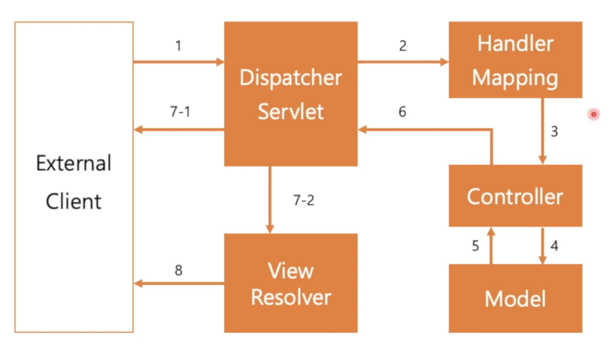

# Controller와 RestController

학습목표
- Spring MVC
- Controller와 RequestMapping
- Controller와 RestController

## Spring MVC

Model - View - Controller (패턴)  
- 코드를 어떤식으로 나누어서 사용하는지
- 역할에 따른 분류 (패턴)

View  
- 사용자가 확인하는 데이터의 표현
Controller  
- 사용자의 입출력을 다루는 부분
Model
- 서비스 데이터 자체

사용자가 View에서 모습을 본다.  
사용자가 Controller를 사용하여 (사용) 전달  
Controller는 Model을 조정  
Model은 Controller에서 지시받은 조정을 통해 View를 갱신한다.  
- 즉, 코드들을 어떠한 형태로 구성할 것인지를 생각한 것

Front Controller Pattern  
- Dispatcher Servlet이 (MVC를)직접적으로 관리하고 사용자와 대화하는 것  
External Client  
- 브라우저 또는 다른 클라이언트 프로그램
Dispatcher Servlet  
- Spring Boot의 일부분
Handler Mapping  
- 패스와 실제 메소드와 실제 연결이 어떻게 되어있는지 구성, 관리
Controller  
Model  
- 실제 데이터
View Resolver  
- View 역할

동작  
1. 외부의 요청 발생
2. 요청 경로 확인을 위해 전달
3. Controller로 전달
4. Model 조작
5. 갱신된 데이터 전달
6. 응답 전달
7. 응답을 Client로 전송
   1. 데이터 전송 또는
   2. 데이터를 포함한 View 제작
8. 사용자에게 View 제공

앞의 대부분은 자동으로 되고 우리가 코드를 구성하는 부분은 Controller와 Model부분을 작성한다.

## Controller와 RequestMapping 실습

## Controller와 RequestMapping

요청 경로를 설정하기 위해 Controller Annotation을 사용하자.  
RequestMpping을 이용해 경로에 따라 실행될 함수를 지정할 수 있다.  
Method 별로 별도의 Annotation이 존재한다.  
- GetMapping, PostMapping 등..  

HTML외에 데이터 전송을 위해 Body와 MediaType을 설정할 수 있다.
- View Resolver를 거치지 않고 바로 데이터를 클라이언트에게 돌려준다. (6번 경로)  

RestController  
- 간단하게, Controller + ResponseBody  

기본적으로 어떠한 형태의 응답이든 데이터의 일종이다.  
