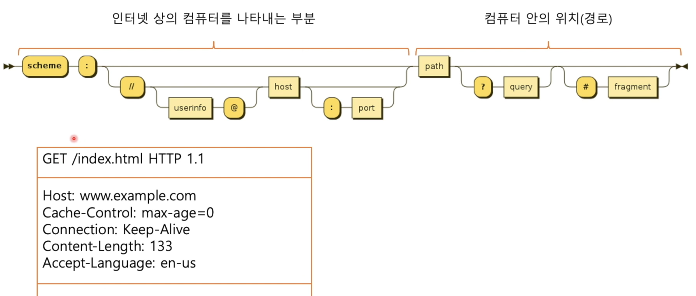

# CRUD와 REST

학습목표
- RESTful이란?
- API를 RESTful하게 설계하는 방법
- RequestMapping 재구성

## RESTful이란?

Roy Fielding  
- HTTP를 만드는데 참여했던 사람
- 이 사람이 작성한 논문에 좋은 API를 만드는 방법이 REST
- REpresentational State Transfer
- 이러한 방식을 따라주면 된다.

REST  
- 서버의 형태에 따라 클라이언트의 형태가 고정되어있을 경우
- 서버와 클라이언트간의 결합성을 줄이기 위한 가이드
- 한쪽이 변화되었을 때 다른쪽에 큰 영향을 주지 말아야한다.
- 클라이언트가 사용할 API를 문제없이 누구든지 사용 가능하게 만드는 것이 REST의 과정이다.

REST 제약사항
- 완벽히 지키기는 매우 어렵기 때문에 잘 지키는 것
1. Client Server Architecture
    - 클라이언트 서버 아키텍쳐를 잘 따른다. 서로가 잘 분리되어있는지
2. Statelessness
    - 상태를 가지지 않는다. API가 상태를 저장하지는 않는다.
3. Cacheability
    - 재사용 가능한 결과인지에 대한 표현
4. Layered System
   - 실제 서버까지 도달하는 과정을 클라이언트가 알 필요가 없다.
5. Uniformed Interface
   - a
6. Code on Demand (Optional, 옵션)
    - 애플리케이션이 실행중인 와중에도 내용물, 기능이 변할 수 있다.

## API를 RESTful하게 설계하는 방법

Client Server Architecture
- 서버와 클라이언트의 분리
- 서로의 변화가 서로에게 영향을 주지 않는 형태가 되어야 한다.
- 서버에서 자원을 관리하고 자원에 관한 표현은 클라이언트에서만 신경을 써야 한다.  
- 즉, 클라이언트가 변한다 하더라도 서버는 변할 필요가 없고 서버가 변한다고 하더라도 클라이언트는 변할 필요가 없다.
- 여기서의 변화의 예로 서버의 버전없이 클라이언트에 영향이 없다.
- 유튜브에서 UI가 변화하더라도 내용물들이 큰 변화가 없다. (댓글을 보여주는 것은 같지만 어떤 보이는 형태만 변화하였다.)

Statelessness
- 상태를 가지고있지 않아야 한다.
- 서버가 요청을 받을 때 마다 매번 다시 확인을 한다.
- 모든 요청은 서로서로 독립적이다. 첫 번째 요청이 두 번째 요청에 영향을 주지 않아야 한다.
- 원하는 기능을 위한 상태는 Client가 가지고 있어야 한다.
- 예시로는 로그인된 상태의 API와 로그인되지 않은 상태의 API는 같지만 서버에게 클라이언트가 인증해주어야 한다.

Cacheablility
- www를 사용하는 수 많은 클라이언트는 캐시 기능을 사용한다.
- 서버에 있던 자원을 클라이언트에 저장해둔다.
- 자주 변하지 않는 사진같은 것들은 클라이언트에 저장을 해두는데 서버가 그런 정보를 알려줘야 한다.
- 자원의 캐싱이 가능한지의 여부를 항상 표기해줘야 한다.

Layered System
- 클라이언트와 서버가 있을 때  
- 일반적으로 요청을 처리하는 서버가 하나가 아닐 수도 있다.
- 클라이언트가 어느 서버에 요청을 해야하는지 알 필요도 없고 어느 곳에 요청하든지 같은 응답이 와야 한다.
- 계층 구조
- 클라이언트는 서버에 도달하기까지의 과정을 알 필요가 없다.
- 그냥 요청을 보내는 것일 뿐이다.

Uniformed Interface
- 일관된 인터페이스 (CRUD)
- 기본적으로 자원을 나타내기 위해서 사용되는 인터페이스
- 어떠한 자원에 대한 요청을 보내는 것인지를 명백하게 나타나야 한다.
- 서버에서 응답을 돌려줄 때 자원 그 자체가 아닌 그 자원의 형태를 띈 데이터(자바의 데이터 쪼가리가 아닌 JSON)를 돌려주는 것

Code on Demand
- 일시적인 기능의 확장
- 사용 가능한 코드를 응답으로 보내 사용자의 기능을 일시적으로 확징시킬 수 있다.
- 필요할수도 있고 아닐 수도 있다.
- 즉, 옵션 선택사항이다.

서비스가 커지면 100% REST의 조건을 만족하기 어렵다.

인터넷 상의 컴퓨터에 도달했다면 자원의 위치를 나타내는데 사용한다.  
기능은 HTTP의 메서드에 작성한다.  
1. 경로를 통해 도달하고자 하는 자원을 지정
2. 방법(Method)을 통해 자원에 실행할 기능을 지정한다.
