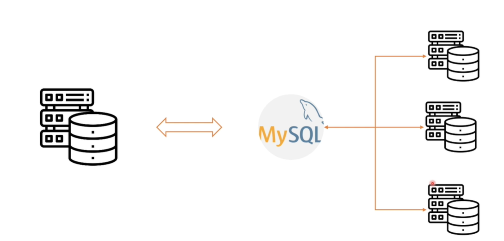

# Database 다뤄보기

학습목표
- 관계형 데이터베이스와 ERD
- MySQL과 Workbench 설치하기
- MySQL에 스키마 / 유저 생성
- 기본적인 SQL 작성법

## 관계형 데이터베이스와 ERD

관계형 데이터베이스
- Codd의 12규칙을 따르고자 하는 Database
- 전부다 따르지는 않는다.

| Id  | Name     | Price | Count |
| --- | -------- | ----- | ----- |
| 1   | Hambuger | 6000  | 50    |
| 2   | Chicken  | 16000 | 10    |
| 3   | Pizza    | 20000 | 5 |

Table(Relation)의 형태로 데이터를 저장  
관계형 연산자로 테이블 형태로 데이터를 반환  

Column : 무엇을 담고있는 가  
Row : Data하나 Entity  
Primary Key : 하나의 Row를 가져올 수 있는 명백한 값

ERD  
- Entity-Realationship Diagram
- 데이터의 표현 방식 중 하나

# MySQL과 Workbench 설치하기

Mysql  
- Download
- Comunity
- MySQL Workbench

MySQL : 서버에 접속하기 위한 클라이언트  

관계형 데이터베이스 서버  
- 서버 소프트웨어 + 물리서버

Users and privileges
- `ckddml7410

