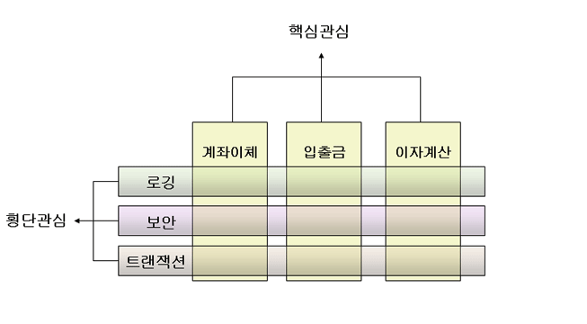
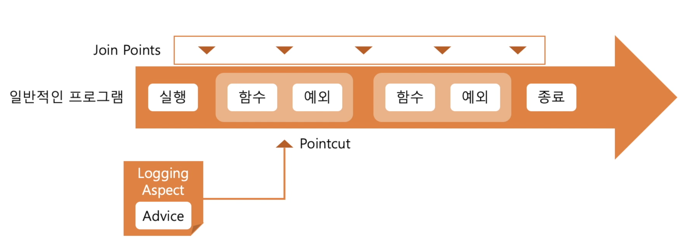

# Spring AOP

Aspect Oriented Programming  
관점지향 프로그래밍 


학습목표
- Aspect Oriented Programming
- AOP의 기초개념


## Aspect Oriented Programming

관점지향 프로그래밍  
```java
    @PostMapping("")
    @ResponseStatus(HttpStatus.CREATED)
    public void createPost(@RequestBody PostDto dto){
        logger.info("start processing");
        this.postService.createPost(dto);
        logger.info("finish processing");
    }
```

시작과 끝에 logger를 작성한다.  
start에서 finish까지의 시간을 측정한다고 생각해보자  

어느 한 함수 처리에 걸리는 시간을 측정하고 싶다.
- 실제 서비스의 흐름은 별개
  - 로그를 남기는 기능
  - 서비스를 제공하기 위한 기능
- 서로 직접적인 연관은 없기 때문에 기능과는 별도로 작성하는 것이 이상적이다.

즉, 서비스 (게시글 읽기, 게시글 작성 등..)과 전혀 연관성이 없지만 함수내부에 구현해주어야 한다. 이것이 별로 좋지가 않다.  

따라서 비즈니스 로직의 기능들 외적으로 작성해서 사용할 수 있게 만드는 것으로 필요성을 느끼게 되었고 Aspect Oriented Programming이 등장하게 되었다.  

Aspect Oriented Programming
- Aspect : 서로 다른 역할의 객체들이 가지는 공통의 관심사
- 서로 다른 비즈니스 로직이 공통적으로 가지는 관심(횡단 관심)에 대하여 고민하는 개발 지향
- 로그를 남긴다라는 기능은 어떠한 비즈니스 로직이든 포함이 되어야 한다. 
- 그렇게 반복적으로 똑같이 작성된다면 소스코드가 복잡해지고 지저분해진다. 
- 따라서 이러한 문제를 어떻게 해소할지를 고민하는 개발지향이다.

3가지 상황을 살펴보도록 하자.
1. 서비스가 실행하는데 걸리는 시간
2. 실행할 때 들어오는 함수의 인자
3. 함수의 반환값들


## AOP의 기본개념

횡단 관심  


기능, 비즈니스 로직들은 세로줄  
이러한 기능들은 보안적인 측면이 있어야 하고 로깅하는 과정도 필요하고 DB과정도 필요하다.  
- 여러가지 핵심 기능들 사이를 모두 횡단하기 때문에 횡단 관심이다.
- 이러한 관심들을 해소하기 위해서 등장했다.

만약 아래의 일반적인 자바 프로그램에 로깅을 하고싶다면 로그의 관점이 생길 것이다.  
그리고 Logging Aspect를 넣고 싶은 Join Point가 있을 것이다.  
PointCut : Logging Aspect가 적용될 Join Point를 적용하기(고르기)위해 사용  
- 소스코드와 비슷하게 특정한 규칙이 있는 문자열로 표현  
Logging Aspect관점에서 실제로 실행되게 될 함수를 Advice라고 한다.  

우리가 구현하게 될 것은 Logging Aspect와 Advice 그리고 PointCut이 된다.  




실제 구현은 JPA 프로젝트의 aspect 패키지에 작성하여 구현하였다.  

```gradle
	implementation 'org.springframework.boot:spring-boot-starter-aop'
```

dependency를 추가해 주어야한다.  