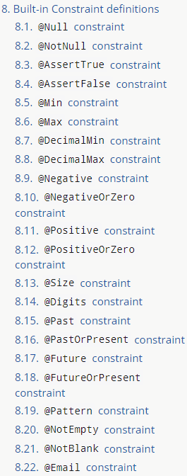

# Validation

Spring Boot에서 Validation을 어떻게 진행할 것인가?

학습목표
- 사용자 입력 검증
- Validation Annotation

## 사용자 입력 검증


제약사항들  
- 제목 : 비어있지 않아야 한다.
- 본문 : 400자 이하
- 작성자 : 3자 이상 10자 이하

사용자의 입력은 어떻게 들어올지 예측하기 어렵다.  

이러한 사용자 입력에 대한 제약사항들은 소스 코드상(if문 등을 활용하여)에서 일일이 확인하는 것은 매우 고된 일이다.  

그래서 이러한 사용자의 입력을 검증하는 부분이 Validation이라는 토픽이다.  

Spring boot에서는 Jakarta Bean Validation을 사용한다.  
Java Bean Validation : 객체 상의 제약사항의 명세를 제공하기 위한 프로젝트  
- (= Jakarta Bean Validation)

비슷한 것
- JPA : 어떤 엔티티가 데이터베이스상의 어떤 부분을 의미하는지를 표현하는 일련의 명세
- 그 과정에서 JPA를 활용하면 ORM에서 잘 사용할 수 있다.

Bean Validation + Hibernate  
- JPA와 Hibernate ORM과의 관계가 비슷하다.  

## Validation Annotation




Bean Validation 프로젝트는 기본적으로 사용자의 입력을 검증하기 위해서 변수에 선언해주는 부분도 있지만 여러가지 제약사항을 직접 정의를 하고 어디에다 붙일지 어떻게 처리할지 같은 부분을 직접 구현할 수 있게 만들어진 부분이 있다.  
하지만 만들 수 있는 개발자가 많은 것은 아니다.  

그래서 미리 만들어진 여러 어노테이션들을 활용해볼 것이다.  

1. Null 여부 : @Null @NotNull
2. String 또는 Collection의 크기 : @Size
3. String 또는 Collection의 Size > 0인지 : @NotEmpty
4. String이 공백을 제외한 문자열인지 : NotBlank

```gradle
	implementation 'org.springframework.boot:spring-boot-starter-validation'
```

dependency를 추가하여야 한다.  


기본적으로 정의된 constraint  
8.3 @AssertTrue : True여야 한다.  
8.4 @AssertFalse : False여야 한다.  
8.5,6 @Min @Max : 최소 최대  
8.7~ 8.12 : 숫자형 변수들을 위해 사용  
8.15 ~ 8.18 : 시간에 대해  
8.19 : 정규표현식에 대한 표현인지 확인  

기본 구성들  
1. @NotNull : null이라면 검증 실패
2. @Size : max min 를 넘어서면 검증 실패 
3. @NotBlank : 문자열이 공백으로만 구성되어 있다면 검증 실패
4. @NotEmpty : 문자열이 비어있다면 검증 실패("") 즉, null일 때도 검증 실패

