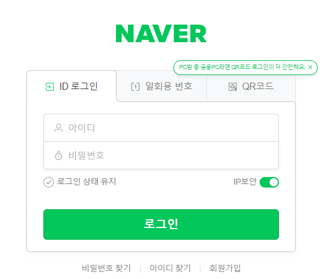
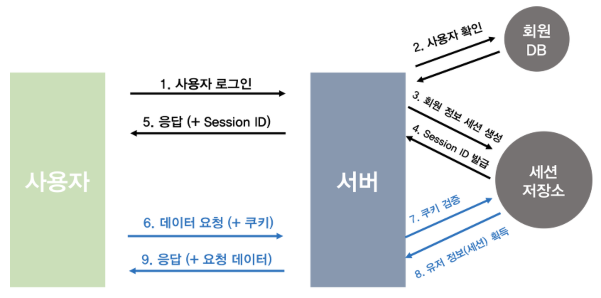

# Auth의 의미

로그인과 로그인 이후에 일어나는 일들  

학습 목표
- Authorization & Authentication
- HTTPS

## Authorization & Authentication

Login
- 한 개인이 자기 자신을 증명함으로서 특정 컴퓨터 시스템에 접근하는 행위
- 예시, 데이터베이스, 네이버, linuxOS, window, MAC등...

Auth
- Authentication: 사용자가 자신이 누구인지를 증명하는 과정
  - 로그인, 소셜 로그인, API 등..
  - 명백한 방법론이 있다.
- Authorization: 사용자의 기능 사용 권한을 검증하는 과정
  - 권한 관리, 작성, 차단 등..
  - 개발자의 능력차이가 많이 발생

Browser에서는 데이터를 쿠키라는 정보로 가지고 있다.  
브라우저에서 만들기도 하고 서버에서 주기도 한다.  

1. 브라우저가 로그인 요청을 한다.  
2. 서버에서는 데이터베이스 조회를 통해서 사용이 가능한 사용자인지 데이터를 받아온다. 
3. 가능한 유저라면 sessionid를 가져와 사용자에게 쿠키로 저장하도록 반환한다.  
4. 그 다음단계부터는 모든 HTTP요청에는 sessionid를 포함시켜 요청한다.
5. 따라서 서버는 사용자의 요청이 어떤 유저에게 온 요청인지가 식별이 가능하다.  

로그인 여부를 파악한다.  

쿠키는 도메인 기반으로 저장되기 때문에 다른 도메인에서는 해당 쿠키를 확인을 할 수 없다.  
naver.com 도메인에서 저장된 쿠키는 오직 naver.com에서만 사용할 수 있다.  

## HTTPS

HTTPS의 기반 기술 TLS
- 컴퓨터 네트워크 상에 정보를 안전하게 공유하기 위한 암호화 규칙이다.  
- 흔히 말하는 HTTPS는 HTTP에 TLS가 적용된 형태이다. 
- 우리가 사용하는 대부분의 도메인은 HTTPS이고 이것이 적용되어 있지 않다면 조금 위험한 도메인이다.  

암호화  
- 특정 규칙(알고리즘)을 가지고 평범한 데이터를 제3자가 확인할 수 없도록 정보를 숨기는 과정이다.  

대칭키 암호화
- 같은 키를 사용하여 암호화
- 빠르고 자원 소모가 적다.
- 양측이 동일한 키를 가지고 있어야 한다, 대칭키

비대칭키 암호화, 공개키 암호
- 서로 다른 키를 사용하여 암호화
- 개인 키를 공개하지 않아 보안이 뛰어나다.
- 하드웨어 자원 소모가 크다.
- 암호화 복호화 속도가 느리다.

대칭키 암호화  
평문 : Hello World!
Key : 8  
시저암호 8  
암호문: Pmttw Ewztl!  
Key를 활용하여 다시 평문으로 만들 수 있다.  

비대칭키 암호화  
공개키: 공개되어있는 키, 누구에게나 공유한다.    
개인키: 서버내부에서만 저장되고 사용하여 공개를 하지 않는다.  

암호화는 공개키를 사용하여 암호화한다.  
개인키를 사용하여 복호화한다.  

TLS는 두가지 방법 모두를 사용한다.  

TLS  
요청, 사용 가능한 암호화 방식을 서버로 보낸다.  
응답, 선택한 암호화 방식 및 인증서를 클라이언트에게 보낸다.  

1. 브라우저는 대칭키를 만들고 서버의 공개키로 암호화한다. 
2. 서버는 개인키로 대칭키를 확인한다.  
3. 공유된 대칭키를 이용해서 서로 대칭키로 암호화 복호화를 진행하면서 요청/응답을 사용한다.  

공개키 암호화의 보안과 대칭키 암호화의 속도를 동시에 만족하기 위해서 만들어진 방식이다.  
TLS가 적용되지 않은 서버는 얼마든지 데이터가 유출될 수 있다.  

