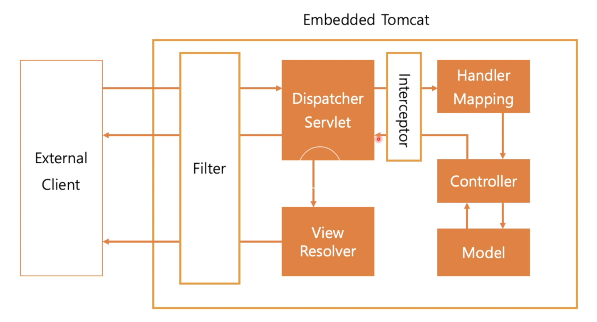

# Filter & Interceptor

학습목표
- Flter & Interceptor 기본 개념
- Filter 구현하기
- HandlerInterceptor 구현하기


## Filter & Interceptor 기본 개념


서버가 받게되는 모든 요청 / 응답에 기능을 적용하고 싶을 때는?  




Filter는 Spring외부에 구현되어 Bean에 등록되면 자동으로 Filter에도 등록된다.  

Filter는 Spring 외부에서, Interceptor는 Spring 내부에서 작동한다.

예외처리는 대부분 Spring 내부에서 작동한다.  
따라서 Interceptor에서 작동하는 예외는 우리가 작성한 설정대로 처리된다.  
Filter에서 작동하는 예외는 불가능하다.  

```java
// Filter Interface
public void doFilter(ServletRequest request, ServletResponse response, FilterChain chain) throw IOEception, ServletExcveption;
```

doFilter() 함수를 구현한다.  
HttpServletRequest, HttpServletResponse를 기본 인터페이스로 사용하지않는다.  
즉, 조작이 가능하다.  
FilterChain 변수를 사용해 filter의 전후를 구분한다.  


```java
// Interceptor 
@Override
public boolean preHandle(
    HttpServletRequest request,
    HttpServletResponse response,
    Object handler
) throw Exception{
    return true
}
```

preHandle(), postHandle(), afterCompletion()으로 구현할 함수가 나눠져 있다.  


postHandle()에서 ModelAndView 객체를 조작할 수 있다.  
afterCompletion()은 뷰가 랜더가 되고 사용자에게 전달 후 실행된다.  

Filter
- Jakarta Servlet API의 일부
- doFilter() 함수를 구현
- 요청, 응답을 조작할 수 있음
- Buisness Logic과 무관한 기능 구현에 사용 
  - 보안
  - 데이터 인코딩

HandlerInterceptor
- Spring Application의 일부
- preHandle(), postHandler(), afterCompletion() 함수를 구현
- Buisness Logic과 연관성이 높은 기능 구현에 사용
  - 사용자 인증
  - API 처리 내용


